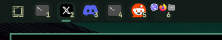

# Workspace Apps for Omarchy

A compact Omarchy top-bar workspace widget that shows which applications are open in each workspace.



## Features

- Displays up to three application icons per workspace
- Groups multiple applications inside one compact workspace tile
- Shows the workspace number in the bottom-right corner
- Highlights the active workspace without heavy borders
- Maps Omarchy terminals and common Chrome web apps to their proper icons
- Provides clean app-name tooltips

## Install

```bash
omarchy plugin add https://github.com/elixirblend/omarchy-workspace-apps --enable
omarchy plugin enable sofos.workspaces left
```

The widget is compatible with Omarchy Shell's horizontal and vertical bars.

## Remove

```bash
omarchy plugin remove sofos.workspaces
```

## License

MIT
